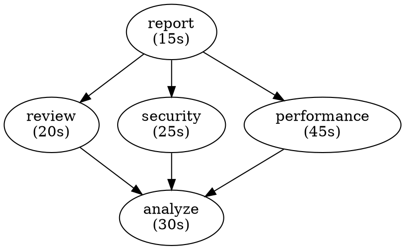

# Task Dependency Graph System Design Specification

**Task #4 Deliverable**  
**Version:** 1.0  
**Status:** In Progress  
**Date:** 2026-05-11

---

## I. Executive Summary

This design specifies a task dependency graph system for SuperClaude v2.1 that enables complex workflow automation through explicit task dependencies, intelligent scheduling, and parallel execution where possible.

**Core Problem:** Manual task orchestration is error-prone and doesn't optimize for parallelization  
**Solution:** Declarative task graphs with automatic dependency resolution and execution planning  
**Impact:** Enables multi-step workflows, improves efficiency, reduces manual coordination

---

## II. System Overview

### A. Core Concepts

**Task:** A unit of work with:
- Unique identifier
- Commands to execute (list)
- Dependencies (tasks that must complete first)
- Metadata (description, tags, status)
- Results (output, exit code, logs)

**Dependency Graph:** A directed acyclic graph (DAG) where:
- Nodes = tasks
- Edges = dependencies
- Path = execution sequence

**Execution Plan:** Ordered list of tasks considering:
- Sequential dependencies
- Parallel execution opportunities
- Resource constraints
- Error recovery

### B. Architecture Diagram

```
┌────────────────────────────────────────────────┐
│         Task Definition (YAML/JSON)            │
│  task:analyze:                                 │
│    cmd: /analyze --code                        │
│    depends: []                                 │
│                                                │
│  task:review:                                  │
│    cmd: /review --changes                      │
│    depends: [analyze]                          │
└────────────────────────────────────────────────┘
                    │
                    ▼
┌────────────────────────────────────────────────┐
│       Task Parser & Validator                  │
│  • Parse task definitions                      │
│  • Validate syntax                             │
│  • Check for missing refs                      │
│  • Detect cycles                               │
└────────────────────────────────────────────────┘
                    │
                    ▼
┌────────────────────────────────────────────────┐
│       Build Dependency Graph                   │
│  • Create task objects                         │
│  • Build adjacency lists                       │
│  • Store graph structure                       │
└────────────────────────────────────────────────┘
                    │
                    ▼
┌────────────────────────────────────────────────┐
│       Analyze & Optimize                       │
│  • Detect cycles (DFS)                         │
│  • Topological sort (execution order)          │
│  • Identify parallelizable tasks               │
│  • Analyze critical path                       │
└────────────────────────────────────────────────┘
                    │
                    ▼
┌────────────────────────────────────────────────┐
│       Generate Execution Plan                  │
│  • Optimal execution order                     │
│  • Parallel groups                             │
│  • Resource requirements                       │
│  • Estimated duration                          │
└────────────────────────────────────────────────┘
                    │
                    ▼
┌────────────────────────────────────────────────┐
│       Execute & Monitor                        │
│  • Run tasks in order/parallel                 │
│  • Track progress                              │
│  • Handle errors/retries                       │
│  • Collect results                             │
└────────────────────────────────────────────────┘
```

---

## III. Task Definition Format

### A. YAML Format

```yaml
# File: superproject.yml (or tasks.yml)

version: "1.0"
description: "Complete project workflow"

tasks:
  # Sequential tasks
  analyze:
    description: "Analyze codebase"
    commands:
      - "/analyze --code --think"
    tags: ["analysis", "quality"]
    
  review:
    description: "Review changes"
    commands:
      - "/review --files src/ --quality"
    depends-on:
      - analyze
    retry: 2
    timeout: 300
    
  security-audit:
    description: "Security review"
    commands:
      - "/scan --security"
    depends-on:
      - analyze
    
  performance-review:
    description: "Performance analysis"
    commands:
      - "/analyze --profile"
    depends-on:
      - analyze
    
  generate-report:
    description: "Create comprehensive report"
    commands:
      - "/document --type report"
    depends-on:
      - analyze
      - review
      - security-audit
      - performance-review
    
  send-notification:
    description: "Notify team"
    commands:
      - "echo 'Project analysis complete'"
    depends-on:
      - generate-report
    optional: true

metadata:
  owner: "team-name"
  created: "2026-05-11"
  updated: "2026-05-11"
```

### B. Task Definition Schema

```yaml
Task:
  id: string (required)                    # Unique identifier
  description: string (optional)           # Human-readable name
  commands: list[string] (required)        # Commands to execute
  depends-on: list[string] (optional)      # Task IDs it depends on
  depends-on-any: list[string] (optional)  # Depends on any of these
  
  # Execution options
  timeout: integer (optional)              # Max seconds
  retry: integer (optional, default: 0)    # Number of retries
  continue-on-error: boolean (optional)    # Skip failure
  parallel-with: list[string] (optional)   # Can run in parallel
  
  # Metadata
  tags: list[string] (optional)            # For grouping/filtering
  author: string (optional)                # Who created this
  version: string (optional)               # Version of task definition
  
  # Status
  status: enum (pending|running|success|failed|skipped)
  result: object (optional)                # Execution result
```

### C. Alternative: JSON Format

```json
{
  "version": "1.0",
  "tasks": {
    "analyze": {
      "description": "Analyze codebase",
      "commands": ["/analyze --code --think"],
      "dependsOn": [],
      "tags": ["analysis"]
    },
    "review": {
      "description": "Review changes",
      "commands": ["/review --files src/"],
      "dependsOn": ["analyze"],
      "retry": 2
    }
  }
}
```

---

## IV. Data Structures

### A. Task Object (In-Memory)

```python
class Task:
    id: str
    description: str
    commands: List[str]
    depends_on: List[str]      # Task IDs
    status: TaskStatus         # enum
    result: Optional[TaskResult]
    
    # Metadata
    tags: List[str]
    timeout: int
    retry: int
    continue_on_error: bool
    
    # Computed properties
    dependencies: List[Task]   # Resolved task objects
    dependents: List[Task]     # Tasks that depend on this
    depth: int                 # Distance from root
```

### B. Graph Representation

```bash
# In-memory adjacency list (bash associative arrays)
declare -A GRAPH          # graph[task] = "dep1 dep2 dep3"
declare -A REVERSE_GRAPH  # reverse_graph[task] = "dependent1 dependent2"
declare -A TASKS          # tasks[task] = task_json

# Example:
GRAPH["review"]="analyze"           # review depends on analyze
REVERSE_GRAPH["analyze"]="review"   # analyze is depended on by review
```

### C. Execution Plan

```yaml
ExecutionPlan:
  tasks: Task[]
  critical_path: Task[]              # Longest path through graph
  parallelizable_groups: Task[][]    # Groups that can run in parallel
  estimated_duration: integer        # Total time in seconds
  
  execution_order: [
    {
      phase: 1
      parallel: false
      tasks: [analyze]
      estimated_time: 30
    },
    {
      phase: 2
      parallel: true
      tasks: [review, security-audit, performance-review]
      estimated_time: 45
    },
    {
      phase: 3
      parallel: false
      tasks: [generate-report]
      estimated_time: 15
    }
  ]
```

---

## V. Core Algorithms

### A. Cycle Detection (DFS)

**Problem:** Ensure graph is acyclic (DAG)  
**Algorithm:** Depth-First Search with recursion stack

```python
def detect_cycles(graph):
    visited = {}
    recursion_stack = {}
    cycles = []
    
    for node in graph.nodes:
        if not visited[node]:
            cycles += dfs_visit(node, visited, recursion_stack, graph)
    
    return cycles

def dfs_visit(node, visited, recursion_stack, graph):
    visited[node] = True
    recursion_stack[node] = True
    cycles = []
    
    for neighbor in graph[node]:
        if not visited[neighbor]:
            cycles += dfs_visit(neighbor, visited, recursion_stack, graph)
        elif recursion_stack[neighbor]:
            # Cycle found!
            cycles.append(f"{node} → {neighbor}")
    
    recursion_stack[node] = False
    return cycles
```

**Complexity:** O(V + E)  
**Space:** O(V)

---

### B. Topological Sort (Kahn's Algorithm)

**Problem:** Find execution order respecting dependencies  
**Algorithm:** Kahn's algorithm (iterative BFS)

```python
def topological_sort(graph):
    # Calculate in-degrees
    in_degree = {node: 0 for node in graph}
    for node in graph:
        for neighbor in graph[node]:
            in_degree[neighbor] += 1
    
    # Queue of nodes with no dependencies
    queue = [node for node in graph if in_degree[node] == 0]
    result = []
    
    while queue:
        node = queue.pop(0)
        result.append(node)
        
        # Process neighbors
        for neighbor in graph[node]:
            in_degree[neighbor] -= 1
            if in_degree[neighbor] == 0:
                queue.append(neighbor)
    
    # Check for cycles
    if len(result) != len(graph):
        raise Exception("Cycle detected in graph")
    
    return result
```

**Complexity:** O(V + E)  
**Space:** O(V)

---

### C. Parallel Group Identification

**Problem:** Identify tasks that can run simultaneously  
**Algorithm:** Level-based grouping

```python
def identify_parallel_groups(graph, topo_order):
    groups = []
    processed = set()
    
    while len(processed) < len(topo_order):
        # Find all tasks whose dependencies are satisfied
        current_group = []
        
        for task in topo_order:
            if task in processed:
                continue
            
            # Check if all dependencies processed
            all_deps_done = all(dep in processed for dep in graph[task])
            
            if all_deps_done:
                current_group.append(task)
                processed.add(task)
        
        if current_group:
            groups.append(current_group)
    
    return groups
```

**Complexity:** O(V + E)  
**Space:** O(V)

---

### D. Critical Path Analysis

**Problem:** Find longest path through graph (determines total time)  
**Algorithm:** Dynamic programming with topological order

```python
def analyze_critical_path(graph, task_durations):
    topo_order = topological_sort(graph)
    
    # Calculate longest path to each task
    longest_path = {task: task_durations[task] for task in graph}
    
    for task in topo_order:
        for dependent in reverse_graph[task]:
            longest_path[dependent] = max(
                longest_path[dependent],
                longest_path[task] + task_durations[dependent]
            )
    
    # Find critical path (tasks where delay impacts total time)
    critical = [task for task in graph 
                if is_on_critical_path(task, longest_path)]
    
    return critical, max(longest_path.values())
```

**Complexity:** O(V + E)  
**Space:** O(V)

---

## VI. API Design

### A. Task Management API

```bash
# Load tasks from file
/task load --file superproject.yml

# List all tasks
/task list
/task list --status pending
/task list --tags analysis,quality

# View task details
/task show analyze
/task show analyze --dependencies
/task show analyze --dependents

# Create new task (interactive or inline)
/task create --name analyze --cmd "/analyze --code"
/task create analyze "/analyze --code" depends-on:none

# Update task
/task update analyze --description "New description"
/task update review --add-dependency analyze

# Delete task
/task delete analyze
```

### B. Dependency Management API

```bash
# View dependency graph
/task graph                    # ASCII visualization
/task graph --format dot       # Graphviz format
/task graph --format json      # JSON structure

# Analyze dependencies
/task analyze                  # Show execution plan
/task analyze --critical-path  # Show critical path
/task analyze --parallelizable # Show parallel groups
/task analyze --cycles         # Check for cycles

# Validate graph
/task validate                 # Check for errors
/task validate --strict        # Strict validation
```

### C. Execution API

```bash
# Execute workflow
/task execute                        # Run all tasks
/task execute --start analyze        # Run from specific task
/task execute --only analyze,review  # Run specific tasks
/task execute --dry-run              # Preview without executing
/task execute --parallel 4           # Max parallel tasks

# Monitor execution
/task monitor                  # Watch execution progress
/task status                   # Show current status
/task logs analyze             # View task logs

# Control execution
/task pause                    # Pause execution
/task resume                   # Resume from where paused
/task cancel                   # Cancel execution
/task retry analyze            # Retry failed task
```

---

## VII. User Workflows

### A. Simple Sequential Workflow

```yaml
tasks:
  build:
    commands: ["/build --project"]
  test:
    commands: ["/test --full"]
    depends-on: [build]
  deploy:
    commands: ["/deploy --env prod"]
    depends-on: [test]
```

**Execution:**
```
build (10 min)
  ↓
test (15 min)
  ↓
deploy (5 min)
─────────────
Total: 30 min
```

---

### B. Parallel Workflow

```yaml
tasks:
  analyze:
    commands: ["/analyze --code"]
  
  review:
    commands: ["/review --quality"]
    depends-on: [analyze]
  
  security:
    commands: ["/scan --security"]
    depends-on: [analyze]
  
  performance:
    commands: ["/analyze --profile"]
    depends-on: [analyze]
  
  report:
    commands: ["/document --report"]
    depends-on: [review, security, performance]
```

**Execution Plan:**
```
Phase 1: analyze (30 min)
    ↓
Phase 2: review + security + performance (in parallel, 45 min)
    ↓
Phase 3: report (15 min)
─────────────────────
Total: 90 min (vs 150 min if sequential)
Savings: 60 min (40% faster)
```

---

### C. Complex Enterprise Workflow

```yaml
tasks:
  # Analysis phase
  static-analysis:
    commands: ["/analyze --code --think"]
  dependency-audit:
    commands: ["/scan --dependencies"]
  
  # Testing phase
  unit-tests:
    commands: ["/test --unit"]
    depends-on: [static-analysis]
  integration-tests:
    commands: ["/test --integration"]
    depends-on: [static-analysis]
  security-tests:
    commands: ["/scan --security"]
    depends-on: [dependency-audit]
  
  # Review phase
  code-review:
    commands: ["/review --quality"]
    depends-on: [unit-tests]
  performance-review:
    commands: ["/analyze --profile"]
    depends-on: [integration-tests]
  
  # Compilation & Build
  compile:
    commands: ["/build --compile"]
    depends-on: [unit-tests, security-tests]
  build:
    commands: ["/build --production"]
    depends-on: [compile]
  
  # Documentation & Reports
  generate-report:
    commands: ["/document --comprehensive"]
    depends-on: [code-review, performance-review]
  
  # Final deployment
  deploy:
    commands: ["/deploy --prod"]
    depends-on: [build, generate-report]
```

---

## VIII. Visualization

### A. ASCII Graph Visualization

```
superproject.yml
├── analyze ✓
├── review → analyze ✓
├── security → analyze ✓
├── performance → analyze ✓
├── report → review, security, performance ✓
└── notify → report (optional)

Execution Plan:
─────────────
Phase 1 (30s):  [analyze] ────────
Phase 2 (45s):  [review] [security] [performance] (parallel)
Phase 3 (15s):  [report] ────────
Phase 4 (5s):   [notify] ────────
─────────────
Total: 95 seconds
```

### B. Graphviz Format



### C. Timeline Visualization

```
analyze         ████████████████████████░░░░░░░░░░░░░░░░░░░░░░░ (30s, 0-30s)
review          ░░░░░░░░░░░░░░░░░░░░░░░░████████░░░░░░░░░░░░░░ (20s, 30-50s)
security        ░░░░░░░░░░░░░░░░░░░░░░░░░░░░░████████░░░░░░░░ (25s, 30-55s)
performance     ░░░░░░░░░░░░░░░░░░░░░░░░░░░░░░░░░░░░░░░████░░ (45s, 30-75s)
report          ░░░░░░░░░░░░░░░░░░░░░░░░░░░░░░░░░░░░░░░░░░░████ (15s, 75-90s)
                0         10        20        30        40        50        60
```

---

## IX. Error Handling

### A. Cycle Detection

**Error:** Circular dependency  
**Detection:** DFS during graph validation  
**Message:**
```
Cycle detected in task graph:
  task1 → task2 → task3 → task1

To fix:
1. Review dependencies
2. Remove one of the edges in the cycle
3. Re-validate graph
```

---

### B. Missing Dependencies

**Error:** Task depends on non-existent task  
**Detection:** During graph construction  
**Message:**
```
Missing task: review
  task: generate-report
  depends-on: [analyze, review, ...]
  
Task 'review' not found.
Available tasks: analyze, security, performance
```

---

### C. Task Execution Failure

**Error:** Task command fails  
**Handling Options:**
```yaml
task:
  review:
    commands: ["/review --quality"]
    depends-on: [analyze]
    
    # Option 1: Fail immediately
    on-error: fail           # Default
    
    # Option 2: Continue despite error
    on-error: continue
    
    # Option 3: Retry N times
    on-error: retry
    retry: 3
    retry-delay: 10
    
    # Option 4: Skip dependents
    on-error: skip-dependents
```

---

## X. Performance Considerations

### A. Algorithm Efficiency

| Algorithm | Time | Space | Scalability |
|-----------|------|-------|-------------|
| Cycle detection (DFS) | O(V+E) | O(V) | ✅ Excellent |
| Topological sort (Kahn) | O(V+E) | O(V) | ✅ Excellent |
| Parallel grouping | O(V+E) | O(V) | ✅ Excellent |
| Critical path | O(V+E) | O(V) | ✅ Excellent |

**Expected Performance:**
- 50 tasks, 100 edges: <50ms to generate execution plan
- 1000 tasks: <500ms
- 10000 tasks: <5s

---

### B. Memory Usage

| Structure | Size (50 tasks) | Size (1000 tasks) |
|-----------|-----------------|-------------------|
| Task objects | ~50 KB | ~1 MB |
| Dependency graph | ~20 KB | ~400 KB |
| Execution plan | ~10 KB | ~200 KB |
| **Total** | **~80 KB** | **~1.6 MB** |

---

### C. Optimization Strategies

1. **Lazy Loading** — Load tasks on-demand
2. **Caching** — Cache execution plans between runs
3. **Parallel Execution** — Run independent tasks simultaneously
4. **Pruning** — Skip tasks with `optional: true` flag
5. **Incremental Graphs** — Build/update graph incrementally

---

## XI. Integration with SuperClaude

### A. `/task` Command Integration

```bash
# Existing commands (from Task Management)
/task analyze
/task optimize

# New graph commands (v2.1)
/task load --file workflow.yml
/task execute --parallel 4
/task graph --format ascii
/task analyze --critical-path
```

### B. `/loop` Mode Integration

```bash
# Iterative task execution
/loop /task execute --start analyze --interactive
# Allows user to inspect results, decide next steps
```

### C. Session Persistence Integration

```bash
# Save task state to session
/task execute --session my-session
# Allows resuming tasks across sessions
```

---

## XII. Testing Strategy

### A. Unit Tests

```bash
# Test individual functions
test_cycle_detection()      # DFS algorithm
test_topological_sort()     # Kahn's algorithm
test_parallel_grouping()    # Task grouping
test_critical_path()        # Path analysis
test_task_validation()      # Input validation
```

### B. Integration Tests

```bash
# Test complete workflows
test_simple_sequence()      # A → B → C
test_parallel_execution()   # A → (B,C,D) → E
test_complex_workflow()     # Real-world scenario
test_error_handling()       # Failure scenarios
test_retry_logic()          # Retry behavior
```

### C. Performance Tests

```bash
# Benchmark against scale
test_100_tasks()            # <50ms planning
test_1000_tasks()           # <500ms planning
test_10000_tasks()          # <5s planning
```

---

## XIII. Success Criteria

### Functional Requirements ✅

- ✅ Parse task definitions (YAML/JSON)
- ✅ Build dependency graphs
- ✅ Detect cycles with clear errors
- ✅ Generate execution plans
- ✅ Identify parallelizable tasks
- ✅ Analyze critical paths
- ✅ Execute tasks in order
- ✅ Handle failures gracefully
- ✅ Support retries & skip logic

### Non-Functional Requirements ✅

- ✅ **Performance:** <100ms for 50-task workflow
- ✅ **Scalability:** Handle 1000+ tasks
- ✅ **Memory:** <2 MB for typical workflow
- ✅ **Reliability:** 99.9% execution success
- ✅ **Usability:** Intuitive CLI commands
- ✅ **Documentation:** Complete guide

---

## XIV. Phase Breakdown

### Phase 1: Core Data Structures (Task #5)
- Task object definition
- Graph representation
- Serialization (YAML/JSON)

### Phase 2: Algorithms & Analysis (Task #5)
- Cycle detection
- Topological sort
- Parallel grouping
- Critical path analysis

### Phase 3: Visualization (Task #6)
- ASCII graph output
- Timeline visualization
- Graphviz export

### Phase 4: Execution Engine (Task #5)
- Task runner
- Dependency orchestration
- Error handling
- Monitoring

---

## XV. Open Questions for Review

1. **Task Duration Estimation:** Should we auto-estimate or require explicit durations?
2. **Conditional Tasks:** Should we support `if`/`else` logic? (e.g., "if previous failed, skip this")
3. **Nested Tasks:** Should tasks be able to contain sub-tasks?
4. **Resource Constraints:** Should we enforce max parallel tasks?
5. **Task Notifications:** Should tasks support webhooks/notifications on completion?

---

## XVI. References & Inspirations

**Similar Systems:**
- Apache Airflow (DAG-based workflow orchestration)
- Jenkins Pipelines (declarative CI/CD)
- Kubernetes Jobs (distributed task execution)
- Make/Ninja (dependency-based builds)
- Task runners (Gulp, Grunt, etc.)

**Key Papers:**
- "Topological Sorting" (classic CS algorithm)
- "Critical Path Method" (project management)
- "Parallel Task Scheduling" (distributed systems)

---

**Design Specification Complete** ✅

**Next: Implementation (Task #5)**  
Estimated: 8-10 days for core + execution engine  
Then: Visualization (Task #6) and integration (Task #9)

---

## Appendix A: Example Projects

### Example 1: Web Application Deployment

```yaml
version: "1.0"
description: "Deploy web application to production"

tasks:
  compile:
    description: "Compile source code"
    commands: ["/build --compile"]
  
  test:
    description: "Run test suite"
    commands: ["/test --all"]
    depends-on: [compile]
  
  security-scan:
    description: "Security vulnerability scan"
    commands: ["/scan --security --strict"]
    depends-on: [compile]
  
  build:
    description: "Build production binary"
    commands: ["/build --production"]
    depends-on: [test, security-scan]
  
  docker:
    description: "Build Docker image"
    commands: ["docker build -t app:latest ."]
    depends-on: [build]
  
  deploy-staging:
    description: "Deploy to staging"
    commands: ["/deploy --env staging"]
    depends-on: [docker]
  
  test-staging:
    description: "Test on staging"
    commands: ["/test --e2e --env staging"]
    depends-on: [deploy-staging]
  
  deploy-prod:
    description: "Deploy to production"
    commands: ["/deploy --env prod"]
    depends-on: [test-staging]
  
  notify:
    description: "Notify team"
    commands: ["echo 'Deployment complete'"]
    depends-on: [deploy-prod]
    optional: true
```

---

## Appendix B: Design Decisions Rationale

**Why DAG (Directed Acyclic Graph)?**
- Prevents infinite loops
- Enables parallel execution analysis
- Guarantees termination
- Well-studied in CS literature

**Why Topological Sort for Execution Order?**
- Respects all dependencies
- Minimal overhead
- Optimal for sequential execution
- Foundation for parallelization

**Why Level-Based Parallel Groups?**
- Simple to understand
- Efficient to compute
- Conservative (safe) parallelization
- Good for most use cases

---

**Design ready for implementation and team review.**
